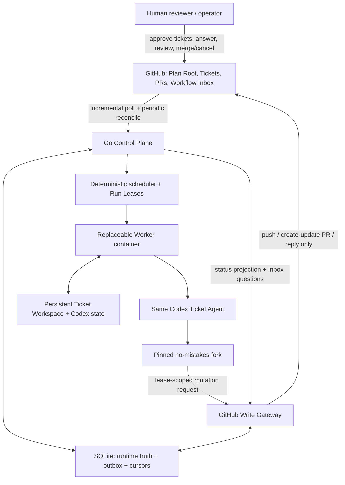

# 建成可恢复、可审计的并行 Agent 交付工作流

Status: approved

## Outcome and non-goals

### Outcome

构建一个单主机、生产级的 Go 控制平面，把已批准的 GitHub Delivery Plan 自动推进为并行但受控的软件交付：

1. `grill-with-docs → to-spec → to-tickets` 负责把人的意图固化为 Plan Root、Executable Tickets、native sub-issue 与 blocked-by DAG。
2. `to-tickets` 完整发布并校验关系后，以最后一个幂等激活动作为执行授权；控制平面只对已激活计划计算确定性 ready frontier。
3. 每个 Executable Ticket 始终绑定一个可恢复的 Codex Ticket Agent、持久 Ticket Workspace、分支、PR 和长期 Delivery Cycle；每次实际计算是有界 Worker Run，运行于可替换 Docker 容器。
4. Ticket Agent 在容器内修改和提交，使用 `no-mistakes` 完成 rebase、自动审查、测试、文档检查、lint、候选修订发布、PR 与 CI；PR 反馈继续交给同一 Ticket Agent，直到人类合并或取消计划。
5. GitHub 保留计划、代码审查与交付结果；SQLite 保留运行时事实。所有外部写操作经过 GitHub Write Gateway，并由 Run Lease、固定 repo/branch/PR 映射和 expected-head 比较共同防止过期 Agent 写入。
6. Workflow Inbox 集中呈现所有必须由人类决定的问题；Plan Root 状态表集中呈现计划与票据状态；PR 仍是代码审查界面。

完成的定义不是“能跑一遍”，而是以下关键路径都有自动化证据：并发领取、重启恢复、重复事件、过期租约、反馈回流、base 前移、门禁询问、PR 被关闭、计划取消、合并后 Delivered 判定、GitHub 限流及外部调用在不确定结果下的对账。

### Non-goals

- 不实现 Kubernetes、多控制平面、分布式锁、消息队列或远程 Worker；需求变化前保持单主机拓扑。
- 不用 LLM 在运行时重新解释票据依赖、重新决定并行集合，或擅自修改已激活 DAG。
- 不自研 `no-mistakes` 已经拥有的 review/test/lint/docs/CI 流水线。
- 不给 Worker 原始 GitHub 写凭据，不允许 Agent 直写 `main`、合并 PR 或代替人类 resolve review thread。
- 不按单容器设置 CPU、内存或磁盘配额；只实施全局 `max_parallel_runs` 和主机压力下的停止派发。
- 不把 Merge Queue 作为正确性前提；可用时把它作为 GitHub 侧额外序列化能力。
- 不在本计划中切分、发布或领取实现 Issues；该动作由计划获批后的 `/plan-to-issues` 完成。

## Decision spine

| Decision | Selected rule and rationale | Evidence | Proof |
|---|---|---|---|
| 双层事实模型 | GitHub Issues/PR 记录请求、讨论和交付历史；SQLite 记录 lease、attempt、cursor、dedup、outbox 等易变运行事实。二者通过稳定 GitHub ID 关联，避免把 GitHub 当分布式运行时数据库。 | [ADR 0001](../../docs/adr/0001-separate-planning-and-runtime-state.md), [ADR 0026](../../docs/adr/0026-use-sqlite-as-the-production-runtime-store.md) | 重启后从 SQLite 恢复，再与 GitHub 全量 reconcile；投影结果不产生重复 Run 或重复写操作。 |
| Plan 激活契约 | Plan Root 永不执行。`to-tickets` 先发布并核验全部子票据与依赖，最后才原子地写入 `workflow:active` 激活标记；控制平面仅导入带 `workflow:ticket` 的子票据。最后动作可重试，部分发布不得派发。 | [ADR 0013](../../docs/adr/0013-model-and-cancel-work-as-delivery-plans.md), [ADR 0014](../../docs/adr/0014-activate-plans-when-to-tickets-completes.md) | 故障注入覆盖每个发布步骤；在最终激活前 frontier 恒为空，重复激活只得到同一 plan version。 |
| 确定性调度 | ready frontier 完全由 approved DAG、Delivered blockers、当前 ownership 和全局 `max_parallel_runs` 决定；排序稳定且跨计划公平。避免第二个 Agent 推翻用户已批准的并行划分。 | [ADR 0015](../../docs/adr/0015-dispatch-the-approved-frontier-deterministically.md), [ADR 0016](../../docs/adr/0016-require-approval-for-active-plan-amendments.md) | 同一 SQLite 快照和配置重复计算得到同一结果；竞争领取测试只产生一个 owner。 |
| Ticket 身份与生命周期 | 一个 Ticket 对应一个 Ticket Session、一个持久 Codex session、一个 workspace/branch/PR/Delivery Cycle；修改意见恢复同一 Agent。容器只承载有界 Worker Run，合并或取消前 Session 不结束。 | [ADR 0002](../../docs/adr/0002-one-delivery-chain-per-executable-ticket.md), [ADR 0006](../../docs/adr/0006-separate-session-run-and-container-lifetimes.md), [ADR 0007](../../docs/adr/0007-bind-one-durable-agent-session-to-each-ticket.md), [ADR 0008](../../docs/adr/0008-persist-workspaces-per-ticket-session.md) | 首轮记录 Codex session ID；反馈轮次使用 `codex exec resume <session-id>`；替换容器后 agent identity 与 workspace head 不变。 |
| At-least-once 与 fencing | Worker Run 可以重复启动，但只有当前 Run Lease 可提交 Candidate Revision；DB CAS 和 Gateway 再验证共同保证最多一个候选被接受。 | [ADR 0005](../../docs/adr/0005-fence-repeated-worker-runs.md), [ADR 0018](../../docs/adr/0018-fence-github-writes-through-one-gateway.md) | 暂停旧容器、让 lease 过期并启动新 Run，再恢复旧容器；旧 Run 的 push/PR/reply 均被拒绝且留下审计记录。 |
| 乐观执行、串行整合 | Tickets 可从已批准基线并发执行；进入 Merge-Ready 前必须基于最新 `main` 重放质量链。人类逐个合并，base 前移会使其他候选失去 Merge-Ready 并重新验证。 | [ADR 0003](../../docs/adr/0003-use-optimistic-execution-and-serialized-integration.md), [ADR 0012](../../docs/adr/0012-reserve-final-merge-authority-for-humans.md) | 两个并行 PR 改动交叠集成面；先合并一个，另一个必须自动失效、rebase、重跑并获得新的 expected head。 |
| 采用而不复制 `no-mistakes` | 固定分叉负责单票据 delivery pipeline；控制平面负责跨票据编排、GitHub 轮询与反馈去重。分叉只加入反馈摄入、长期 cycle/revision 语义、Write Gateway transport 和准确终态。 | [ADR 0009](../../docs/adr/0009-adopt-no-mistakes-as-delivery-controller.md), [ADR 0023](../../docs/adr/0023-keep-orchestration-outside-the-no-mistakes-fork.md), [`CIStep`](https://github.com/kunchenguid/no-mistakes/blob/main/internal/pipeline/steps/ci.go), [`Executor`](https://github.com/kunchenguid/no-mistakes/blob/main/internal/pipeline/executor.go) | 分叉原有测试全绿；兼容测试逐项验证上游 pipeline 行为，新 contract tests 验证 routed feedback、revision re-entry、merged 与 closed-unmerged 分流。 |
| PR 反馈与人工权限 | 私有仓库中所有 human collaborator review/comment 都进入当前 Ticket Session；排除 bot/self，按 GitHub ID 去重，formal review 批量摄入。Agent 只回复证据并请求 rereview；人类 resolve thread 和 merge。 | [ADR 0010](../../docs/adr/0010-route-all-human-pr-feedback-to-the-ticket-agent.md), [ADR 0022](../../docs/adr/0022-reserve-review-thread-resolution-for-humans.md) | 重复轮询和乱序事件只生成一个 Revision Round；Agent 尝试 resolve/merge 时 Gateway 明确拒绝。 |
| 长期 Delivery Cycle | `checks-passed` 表示等待审查，不是完成；反馈产生新 Revision Round。只有 merged 且 revision 可从 `main` 到达才 Delivered；closed-unmerged 进入 NeedsAttention。 | [ADR 0011](../../docs/adr/0011-keep-one-delivery-cycle-through-review.md), [ADR 0021](../../docs/adr/0021-derive-business-state-from-delivery-facts.md) | PR CI 绿后 Session 保持；评论后同一 Agent 产生新 commit；关闭未合并 PR 不会被误报为 passed。 |
| 人类问题单一入口 | 所有 ask-user、澄清、Plan Amendment、取消影响和 NeedsAttention 都以稳定 Question ID 写入一个 repository-level Workflow Inbox；PR review 保留在 PR。 | [ADR 0020](../../docs/adr/0020-use-the-plan-root-as-the-human-control-surface.md), [ADR 0030](../../docs/adr/0030-centralize-human-decisions-in-a-workflow-inbox.md) | 同一原因重试不产生重复问题；`/answer Q-…` 幂等恢复准确 Session；Plan Root 投影链接回问题和 PR。 |
| 自主门禁边界 | `auto-fix` 仅按 finding ID 执行，`no-op` 可继续；`ask-user` 和 `skip` 必须进入 Inbox；禁用全局 `--yes`，也禁止 Agent 绕过 active gate 手改。 | [ADR 0031](../../docs/adr/0031-limit-autonomous-quality-gate-decisions.md), [`axi_drive.go`](https://github.com/kunchenguid/no-mistakes/blob/main/internal/cli/axi_drive.go) | 集成测试为四类 action 构造 finding；只有前两类自动前进，后两类都产生可审计 human decision。 |
| 取消语义 | 人类关闭未合并 PR 冻结整个 Delivery Plan并生成影响报告；人类再选择 replacement ticket 或取消全计划。取消不回滚已合并代码，跨计划依赖保持 blocked/replanned。 | [ADR 0013](../../docs/adr/0013-model-and-cancel-work-as-delivery-plans.md), [ADR 0021](../../docs/adr/0021-derive-business-state-from-delivery-facts.md) | 关闭中间 PR 后不再派发下游；影响报告列全 sub-issues/PR/已交付结果/外部依赖；重复取消幂等。 |
| 运行与资源模型 | 单主机 Go modular monolith + Docker + SQLite；只限制同时活跃 Worker 数。主机压力只停止新派发，不杀正在运行的容器。 | [ADR 0019](../../docs/adr/0019-limit-run-count-without-per-container-quotas.md), [ADR 0025](../../docs/adr/0025-start-with-a-single-host-control-plane.md), [ADR 0027](../../docs/adr/0027-build-the-control-plane-as-a-go-modular-monolith.md) | 压力探针触发时 active Run 不变且 frontier 暂停；压力恢复后继续确定性派发。 |
| 生产级恢复与测试 | SQLite 使用 WAL、FK、durable sync、迁移、备份恢复、outbox；主测试缝是完整控制平面 + 真实临时 SQLite/Git/filesystem + 假外部边界，另有真实 contract/E2E。 | [ADR 0026](../../docs/adr/0026-use-sqlite-as-the-production-runtime-store.md), [ADR 0029](../../docs/adr/0029-test-through-the-whole-control-plane-seam.md) | 进程在每个 side-effect 边界被 kill 后重启；数据库 integrity、状态不变量、无重复 GitHub mutation 均通过。 |

## Architecture and invariants

### Module boundaries

Go module保持一个可部署二进制，但内部边界必须是深模块而不是按技术层散落：

- `internal/plan`: Plan Root 导入、DAG 验证、Plan Amendment、取消影响分析、business-state projection。
- `internal/scheduler`: ready frontier、fair ordering、atomic claim、Run Lease、重试/no-progress 和 capacity gate。
- `internal/agent`: Ticket Session、Codex session 首启/恢复、结构化 turn result、反馈批处理。
- `internal/delivery`: `no-mistakes` adapter、Delivery Cycle/Revision Round、quality gate 与 candidate acceptance。
- `internal/github`: read model/poller、dedup、Workflow Inbox、Plan Root projection、Write Gateway policy。
- `internal/runtime`: Docker 生命周期、workspace/session mounts、host pressure、异常快照和清理。
- `internal/store`: SQLite migrations、事务型 repository、outbox、audit、backup/integrity API。
- `internal/reconcile`: 启动恢复和周期性“本地事实 ↔ Docker/Git/GitHub”收敛。

模块只通过领域命令、查询结果和稳定 ID 交互；外部进程、GitHub API、Docker、Codex CLI、`no-mistakes` CLI 都放在端口之后，测试可替换。

### Required invariants

1. Plan Root 不能成为 Executable Ticket；没有成功写入最终 activation marker 的计划不能产生 Worker Run。
2. 只有所有 blocker 均为 Delivered 的 ticket 才能被 claim；WaitingReview、Merge-Ready 和 closed PR 都不等于 Delivered。
3. 每个 ticket 至多一个 current Ticket Session、一个 current Ticket Agent、一个 branch、一个 PR 和一个 live Run Lease。
4. 每个 Worker Run 只可使用自己的 lease token；租约代际单调递增。DB 接受候选和 Gateway 外部写都必须比较 `(ticket_session_id, lease_generation, expected_remote_head)`。
5. GitHub mutation 先在同一 SQLite 事务中写 outbox，再执行外部调用，再以远端查询结果确认；超时只代表“结果未知”，不得盲重试创建。
6. Worker 容器没有 GitHub 写 token。Control Plane/Gateway 从数据库映射推导 repo、branch、PR、workspace，不接受 Agent 提供任意目标。
7. Ticket Workspace 和 Codex session data 比容器寿命更长。正常轮次边界必须 clean 且 committed；异常退出先记录 dirty snapshot/hash，再按最后 accepted commit 恢复。
8. Review Feedback 只有经过 actor 分类、event ID 去重和批处理后才可创建 Revision Round；同一批反馈只唤醒 Agent 一次。
9. Agent 不得 resolve review thread、merge PR、直写 `main`、更换映射后的 repo/branch/PR，Gateway 不提供这些能力。
10. Delivered 必须同时满足：GitHub 报告 PR merged、记录 merge commit，并验证该 revision 从当前 `main` 可到达。
11. Active DAG 的结构变化只能通过 Plan Amendment；受影响子图暂停，未受影响 frontier 继续运行。
12. 人工问题必须有唯一 Question ID、来源、原因指纹、影响对象和恢复命令；同一 unresolved fingerprint 只有一条 Inbox 项。
13. `ask-user`/`skip` 不得自动批准；`auto-fix` 必须绑定明确 finding ID，不能升级为全局同意。
14. `max_parallel_runs` 是唯一强制容器资源上限；host pressure gate 不终止 active Run。

### State model

Plan 状态为 `Building → Active ↔ Paused → Completed | Cancelled`，任意非终态可因不可自动处理的问题进入 `NeedsAttention`；问题解决后回到其记录的 resume state。

Ticket 状态为 `Queued → Running → WaitingReview → Delivered`，其中新反馈使 `WaitingReview → Running`；异常可进入 `NeedsAttention`；计划取消使未交付 ticket 进入 `Cancelled`。`Merge-Ready` 是可失效的派生资格，不是独立业务终态。

Worker Run 状态为 `Pending → Running → Succeeded | Failed | Superseded | Cancelled`。Run 成功只代表本轮产生了被接受的候选或完成了预期处理，不代表 Ticket Delivered。

Delivery Cycle 覆盖 Ticket 从首次执行到 Delivered/Cancelled。每个 Revision Round 可对应一个新的 `no-mistakes` pipeline run；这复用上游按 branch/head 管理 run 的模型，同时避免把整个业务生命周期错误压进单个 pipeline record。

## Execution map

以下是实现依赖顺序和集成落点，不是后续 Issues 的边界。每一步都要保持系统可编译、迁移可前进/回退，并把新行为接入完整场景测试。

### 1. 固化可执行契约与仓库骨架

- 建立 `go.mod`、`cmd/workflow/main.go` 和上述七个模块目录；CLI 至少暴露 `serve`、`reconcile`、`plan activate`、`plan pause|resume|cancel`、`inbox answer`、`doctor`、`db migrate|backup|restore|integrity`。
- 在 `internal/model`（或各领域模块的公开 contract 文件）定义强类型 ID、枚举和禁止非法转换的构造函数。不要用任意 string 直接改状态。
- 在 `docs/agents/issue-tracker.md` 固化机器契约：
  - Plan Root: `workflow:plan`；Executable Ticket: `workflow:ticket`；最终激活标记: `workflow:active`。
  - `to-tickets` 只有在 issue、sub-issue、blocked-by 全部写入并回读校验后，才执行 `workflow plan activate --root <owner/repo#number>`；该命令以 GitHub 最终标记作为跨进程提交记录。
  - Plan Root 即便保留通用 `ready-for-agent` label 也不得被 scheduler 导入，因为缺少 `workflow:ticket`。
- 为 Ticket Agent 的 Codex turn 定义 JSON Schema：`candidate_ready`、`waiting_for_human`、`plan_amendment`、`needs_attention`，每类都携带稳定引用而不是自由文本触发状态迁移。
- 建立 versioned config schema。`max_parallel_runs`、workspace 根目录、GitHub repo、poll/reconcile 参数、retry policy、backup policy 必须显式配置并经 `doctor` 验证；没有 production config 时拒绝 `serve`。

### 2. 先实现 SQLite 事实核心

- 在 `internal/store/sqlite/migrations` 建立有序迁移并使用 `go:embed`。核心表：
  - `plans`, `plan_versions`, `tickets`, `ticket_dependencies`
  - `ticket_sessions`, `worker_runs`, `run_leases`
  - `delivery_cycles`, `revision_rounds`, `candidate_revisions`
  - `github_events`, `poll_cursors`, `review_feedback`
  - `inbox_questions`, `outbox_mutations`, `audit_events`
  - `workspaces`, `artifacts`, `schema_migrations`
- 启动时强制 `foreign_keys=ON`、WAL 和 durable synchronous mode；检查数据库位于本地文件系统。所有时间戳存 UTC，展示时再转换。
- 用唯一约束表达关键不变量：一个 ticket 一个 current session、一个 session 一个 live lease、同一 GitHub event ID 一次、同一 question fingerprint 一个 unresolved item、同一 outbox idempotency key 一次。
- 把以下操作做成单事务方法：导入/激活 plan version、claim frontier ticket、renew/expire lease、accept candidate、enqueue mutation、confirm mutation、open/answer question、mark delivered、freeze/cancel plan。
- CAS 更新必须携带预期版本或 lease generation；零行更新返回明确的 fencing conflict，不能当成功。
- audit payload 和大日志/快照分开：SQLite 保存类型、hash、路径/URL 和关联 ID；Ticket Workspace 或 artifact store 保存正文。

### 3. 建立 GitHub 读模型、计划导入与人类界面

- 在 `internal/github` 定义窄接口，把 GitHub REST/GraphQL 细节封装在 adapter 内：读取 issue/sub-issue/dependency、PR/head/base/checks/reviews/comments/threads/collaborator identity、default branch reachability。
- poller 使用 persisted cursor/high-water mark 增量读取，并按 rate-limit 自适应退避；每个事件先以 GitHub immutable ID 插入 `github_events`，再派生状态。
- periodic full reconcile 不依赖 cursor：重新读取 active plans、open PR、default branch head、unresolved Inbox 项，与本地投影比较并修复可安全修复的偏差。
- `plan activate` 回读完整 DAG，拒绝：循环、外部未知 blocker、无类型子 issue、重复节点、已关闭但未 Delivered 的 blocker。成功后保存不可变 `plan_version` 和 activation source SHA/更新时间，再写最终 GitHub marker。重复调用返回同一版本。
- Plan Root 维护一个由控制平面编辑的状态表：ticket、blockers、business state、agent/session、branch、PR、current question、last activity。更新使用隐藏 marker 定位自身区块，不覆盖用户正文。
- Workflow Inbox 使用一个固定 repository issue。每条问题包含 `Q-<stable-id>`、来源链接、问题类型、影响范围、允许答案、resume command 和当前状态。解析 `/answer Q-… <payload>` 时校验作者是 collaborator、问题仍 pending、payload 满足 schema。
- human feedback classifier 明确排除 GitHub App/bot、工作流自身帐号和 Ticket Agent 身份；formal review 以 review submission 为 batch boundary，零散 inline comments 以稳定 debounce window 合并。

### 4. 实现 scheduler、lease、outbox 与 Write Gateway

- `internal/scheduler.Frontier` 以一个只读快照计算候选；排序键固定为 plan activation time、ticket topological rank、ticket creation/id，并用 round-robin cursor 避免单计划长期占满全局容量。
- claim 必须在一个 `BEGIN IMMEDIATE` 事务中再次检查 eligibility、capacity 和 ownership，创建/恢复 Ticket Session，写 Worker Run 和新 lease generation。frontier 结果本身不授予执行权。
- lease 采用 heartbeat + TTL；过期只允许新 generation 领取，不删除旧 Run。旧 Run 后续结果记为 `Superseded` 或审计拒绝。
- retry policy 按失败类型分开：基础设施错误指数退避；代码/quality failure 返回同一 Agent；等待人类时释放 compute slot；同原因连续失败或多轮无状态推进进入 NeedsAttention。
- Write Gateway 实现唯一允许的命令集：
  - `push_candidate(expected_remote_head, local_commit)`
  - `create_or_update_pr(mapped_branch, expected_pr)`
  - `reply_to_review(mapped_pr, feedback_ids, evidence)`
  - `update_plan_projection` / `update_inbox`
- Gateway 运行于 Control Plane，Worker 通过 `host.docker.internal`（Linux Docker 显式加入 `host-gateway`）访问本机 HTTP JSON endpoint；每个请求使用短期、per-run lease bearer。endpoint 仅接受 schema 化命令，服务端从 DB 推导 repo/branch/PR/workspace。单主机可信网络内不引入独立 PKI，但 token 不写日志，端口只暴露给本机/Docker bridge。
- `push_candidate` 由 Gateway 在持久 workspace 中确认 commit 是 accepted candidate、当前 remote head 等于 expected head 后执行显式 force-with-lease/普通 push；绝不接受任意 refspec。
- GitHub API 调用使用 outbox idempotency key。创建 PR 超时后先按 mapped branch 查询；评论回复包含隐藏 idempotency marker；已存在对象视为确认，不重复创建。
- Gateway 接口根本不定义 merge、resolve-thread、push-main 或任意仓库写入方法。

### 5. 实现持久 Workspace、Docker 与 Codex Ticket Agent

- `internal/runtime` 为每个 Ticket Session 建立固定 workspace 与 Codex state 目录；记录规范化绝对路径、repo identity、branch、last accepted commit 和 dirty-state hash，禁止路径逃逸。
- 首次运行从已记录 baseline 创建分支和 workspace；后续容器只挂载该 workspace、Codex state、只读源码/工具配置和必要缓存。GitHub 写 token 不进入容器；GitHub read token 若需要则使用 read-only scope。
- 容器命令、镜像 digest、mount、environment allowlist 和 tool versions 全部写 audit。容器停止/丢失不删除 Ticket Session 或 workspace。
- Codex turn 使用 ADR-0024 定义的持久 `exec`/`exec resume` 会话，并遵守 ADR-0004 的可信 sandbox 边界；禁止 `--ephemeral`。
- feedback prompt 只传增量信息：Question answer 或一批 Review Feedback、current branch/head、要求的证据；不重新灌入完整历史。Codex 自身 session 和 workspace 承担上下文连续性。
- 每轮结束执行 workspace checkpoint：
  - 正常：工作树 clean、所有修改 committed，记录 commit/hash。
  - 异常：记录 `git status`、diff artifact hash、进程退出原因；恢复以 last accepted commit 为基点，dirty snapshot 仅供诊断/显式恢复。
- host pressure adapter 读取可用内存/磁盘和 Docker daemon health。超过配置阈值时只关闭 dispatch gate并投影原因；绝不主动 kill active container。

### 6. 对 pinned `no-mistakes` fork 做最窄改造

- 在实现开始时把上游仓库固定到精确 commit SHA，建立 `UPSTREAM.md` 和自动 compatibility workflow；分叉 release 以 immutable tag/digest 被 Worker 镜像引用。
- 保留上游 pipeline/executor/gate 恢复模型，重点围绕已确认 seam 改造：
  - [`internal/pipeline/steps/ci.go`](https://github.com/kunchenguid/no-mistakes/blob/main/internal/pipeline/steps/ci.go)：把 merged、closed-unmerged、checks-passed/waiting-review 作为不同结果；base/head 变化返回可识别的 revalidation reason。
  - [`internal/cli/axi_drive.go`](https://github.com/kunchenguid/no-mistakes/blob/main/internal/cli/axi_drive.go)：不再把 closed-unmerged 映射为 passed；输出 stable cycle/run/revision/gate identifiers；保留 checks-passed 非终态。
  - [`internal/db/run.go`](https://github.com/kunchenguid/no-mistakes/blob/main/internal/db/run.go)：给 pipeline run 增加外部 Delivery Cycle/Revision Round correlation，不把 Ticket 业务状态复制到 fork DB。
  - [`internal/pipeline/steps/push.go`](https://github.com/kunchenguid/no-mistakes/blob/main/internal/pipeline/steps/push.go) 与 [`pr.go`](https://github.com/kunchenguid/no-mistakes/blob/main/internal/pipeline/steps/pr.go)：在配置启用时调用 `MutationGateway`，禁用直接 git/GitHub 写；standalone 上游兼容模式保留原行为。
  - [`internal/scm/host.go`](https://github.com/kunchenguid/no-mistakes/blob/main/internal/scm/host.go)：不要把 workflow-only 编排塞入通用 SCM Host；只增加最小 gateway client/结果类型，避免强迫 GitLab/Bitbucket/Azure 实现 GitHub review 语义。
- 一次 Revision Round 可启动一个新的上游 pipeline run，并通过 correlation 归入同一长期 Delivery Cycle。收到 routed feedback 时终止/标记旧的 waiting monitor 为 superseded，再从 intent/rebase 开始相同质量链。
- `no-mistakes` gate status 是权威结构化输入：Control Plane 在 Agent turn 后查询 `axi status`/run DB 来确认 finding 和允许 action，而不是仅信任 Agent 的自然语言摘要。
- 自动动作只能提交明确 finding ID 的 `auto-fix` 或确认 `no-op`。遇到 `ask-user`/`skip` 时，adapter 创建 Inbox Question 并暂停；回答后恢复同一 Codex session，由 Agent 对原 gate 执行精确响应。
- 对可泛化修改先形成上游 PR；workflow 专属的 gateway/correlation feature flag 留在薄分叉。任何上游升级必须通过原测试、fork contract tests 和 workflow E2E 后才能更新 pin。

### 7. 串起 Delivery Cycle、反馈回流与合并收敛

- 新 Ticket Session 启动时创建唯一 Delivery Cycle 和 Revision Round 1；Agent 产出 committed candidate 后，Control Plane 重新验证 lease，并在单事务中 accept candidate + enqueue gateway mutation。
- `no-mistakes` 完成 push/PR/CI 后，Ticket 进入 WaitingReview；Plan Root 显示 checks/head/PR，但 session、agent、workspace 保留，Worker compute slot 释放。
- poller 收到 actionable feedback 时：去重 → batch → 创建下一 Revision Round → 把 Ticket 改回 Running → 恢复同一 Codex session → 重新跑完整 delivery chain → Gateway 幂等更新原 PR。
- Agent 完成修改后只可通过 Gateway 回复每个 feedback batch，回复包含 commit SHA、测试/quality run URL 或摘要以及 rereview 请求；thread 保持 unresolved 等待人类。
- default branch 前移时，所有基于旧 base 的 Merge-Ready 派生资格失效。只有当前 PR 在最新 base 上完整验证、required checks 绿、没有 required human review 阻塞时，才重新显示 Merge-Ready。
- 发现 PR merged 后，reconciler fetch `main` 并验证 merge/revision reachability，再原子标记 Ticket Delivered、结束 Delivery Cycle、销毁容器、按 retention policy归档 workspace/Codex state，并解锁下游 frontier。
- PR closed-unmerged 时冻结所在 Delivery Plan，停止受影响派发，创建单一 Inbox impact question，列出该 Plan 全部 issues/PRs、已 Delivered tickets、尚未执行 tickets、跨计划 dependents。只有人类选择 replacement 或 cancel 后继续。
- cancel plan 停止新派发、撤销 active lease、优雅终止容器并保留审计/快照；已 merged 结果不回滚。replacement ticket 必须通过 Plan Amendment 生成新 plan version，不能重用已取消 ticket identity。

### 8. 启动恢复、对账、可观测性与运维

- `serve` 启动顺序固定：lock single instance → DB integrity/migrate → validate config/secrets → reconcile workspaces/containers/runs → reconcile GitHub → expire/renew leases → enable scheduler。
- 单实例锁使用本机锁文件并记录 PID/start token；SQLite 事务仍是正确性边界，锁文件只改善运维错误提示。
- reconciler 对每种“不确定结果”有规则：
  - DB pending outbox + 远端对象存在：确认完成。
  - DB pending + 远端不存在且 lease 当前：安全重试。
  - 容器存在但 lease 过期：隔离旧容器，禁止 gateway write，再决定诊断或清理。
  - DB Running 但容器不存在：按失败类型重启新 Worker Run，保持 Ticket Agent/Session。
  - GitHub 状态与本地投影不一致：以业务事实重新派生并写审计，不直接篡改历史记录。
- structured logs 必带 plan/ticket/session/run/lease/cycle/revision/question/outbox correlation IDs；敏感 token、prompt secrets 和完整代码 diff 必须 redaction。
- metrics 至少包括 frontier size、active runs、lease expiry、gateway rejection、outbox age、GitHub rate-limit、poll lag、no-progress、Inbox pending age、time-to-first-PR、time-waiting-review。
- backup 用 SQLite online backup API 生成带校验和快照；定期执行恢复演练到临时路径并运行 migrations/integrity/reconcile dry-run。只有“备份可恢复”才算备份成功。
- `doctor` 检查 Docker、Codex CLI、forked `axi`、Git、GitHub auth scope、branch protections、workspace filesystem、DB WAL/locking、Gateway container connectivity 和版本 pin。

## Validation strategy

### Fast local checks

- `go test ./...`：领域状态机、DAG validation/frontier、dedup、question parsing、retry/no-progress、gateway policy。
- `go test -race ./...`（Linux CI）：并发 claim、lease heartbeat/expiry、poller/outbox/reconciler 竞争。
- `go vet ./...` 与仓库固定版本的 static analysis/format check。
- migration tests：空库逐版升级、旧 fixture 升级、失败迁移 rollback、FK/integrity、backup/restore。
- fork 仓库执行其原生 `go test ./...`，再执行新增 gateway/cycle/outcome contract tests。

### Whole-control-plane scenarios

测试 harness 启动真实临时 SQLite、真实 Git repo/workspaces、完整 scheduler/reconciler/HTTP Gateway；仅替换 GitHub、Docker、Codex 和 `no-mistakes` 外部端口。场景至少覆盖：

1. 部分 `to-tickets` 发布、重复 activation、非法/循环 DAG。
2. 多个 ready tickets 在全局容量下公平并发；竞争 claim 只成功一次。
3. Worker crash、Control Plane crash、Docker daemon restart 和 host reboot 后恢复。
4. 旧 lease Agent 在新 generation 接管后尝试 push/PR/reply，被 DB 与 Gateway 双重 fencing。
5. GitHub mutation 在发送前、发送后未记录、记录确认后三个位置 kill；重启不重复创建 PR/回复。
6. checks green → WaitingReview → 多个 inline comments batch → 同一 Codex session resume → 原 PR 新 revision。
7. bot/self comment 被忽略；human collaborator comment 被接纳；重复/乱序 webhook-like poll data 去重。
8. `auto-fix`、`no-op`、`ask-user`、`skip` 四类 gate 权限。
9. base branch 前移、rebase conflict、required checks 变化与 Merge-Ready 失效。
10. human merge 后 reachability 验证、Delivered、下游解锁。
11. close-unmerged → plan freeze → impact report → replacement 或 cancel；跨计划 dependent 保持 blocked。
12. GitHub rate limit、网络 timeout、Codex CLI失败、`no-mistakes` repeated failure、无 frontier/no progress。
13. host pressure 只暂停派发，不终止 active Run。

### Real contract and end-to-end checks

- Docker contract：目标 Docker Desktop/Engine 上验证 mounts、`host.docker.internal`/`host-gateway`、容器替换、退出码、日志与无 GitHub write token。
- Codex contract：用固定 CLI 版本验证首次 session ID、`exec resume`、JSONL、output schema、Codex state 跨容器恢复；正式依据是 [Codex exec 文档](https://learn.chatgpt.com/docs/developer-commands?surface=cli#cli-codex-exec)。
- `no-mistakes` contract：固定 fork artifact，验证 pipeline/gates/status、Gateway-only mutations、feedback revision、closed-unmerged 和 upstream compatibility。
- GitHub contract：在专用 private test repository 验证 native sub-issues/dependencies、review events、hidden idempotency marker、branch protections、merge detection、rate-limit/reconcile。Merge Queue 只做可选测试；其可用性受仓库组织/计划约束，参见 [GitHub Merge Queue 文档](https://docs.github.com/en/enterprise-cloud@latest/repositories/configuring-branches-and-merges-in-your-repository/configuring-pull-request-merges/managing-a-merge-queue)。
- Full E2E：用两个包含交叠集成面的真实 tickets 运行完整 plan；制造反馈、base 前移、旧 lease write、Control Plane restart，最后由人类合并并验证下游自动解锁。

### Release acceptance

- 所有 Required invariants 都有至少一个负向测试，不仅有 happy path。
- fault-injection suite 在每个 side-effect boundary 重复运行且不产生重复远端对象。
- 数据库从备份恢复后可重建全部 GitHub 投影并继续 active Delivery Cycles。
- Worker 镜像与 fork artifact 由 digest 固定，SBOM/依赖扫描通过；升级流程可重现。
- `doctor` 在目标主机全绿，真实 test repository 的 E2E 全绿，且人工 runbook 演练过 pause/resume/cancel/restore。

## Human gates

### 实现开始前

1. 创建或指定 dedicated private GitHub test repository，并允许测试创建/关闭 issues、PR、reviews 和临时分支。
2. 创建 Gateway/Control Plane 使用的 GitHub App 或等价细粒度凭据；权限只覆盖目标 private repo 的必要 issue/PR/status/ref 写入，Worker 只获得 read-only credential（若确有读取需要）。
3. 在目标仓库配置 human-review branch protection 和 required checks；是否启用 Merge Queue 由仓库能力决定，不影响系统正确性。
4. 建立 `no-mistakes` fork，确认上游 base commit SHA、fork release 位置与贡献回 upstream 的规则。
5. 确认 Codex 认证如何以可恢复但不进入 repo/日志的方式挂载到 Ticket Session，并固定受支持的 Codex CLI 版本。
6. 为目标主机填写 production config，尤其是 `max_parallel_runs`、workspace/backup 路径、retention、poll/reconcile 和主机压力阈值；通过 `workflow doctor` 后才允许激活计划。

### 运行期间

- 人类批准 `to-tickets` 的划分；成功发布后的最终激活动作即为开始自动推进的授权。
- 人类通过 Workflow Inbox 回答 ask-user、skip、Plan Amendment、NeedsAttention 和关闭 PR 后的影响决策。
- 人类在 PR 中 review、resolve thread、approve/reject 和 merge；Agent 只提交修订与证据。
- 任何扩展到多控制平面/远程 Worker、给容器 GitHub 写凭据、放宽 autonomous gate 或改变取消语义的请求，都必须先新增/替换 ADR，而不是作为配置偷偷上线。

## Open decisions

无尚未解决的架构决策。运行参数的具体数值（并发数、poll interval、lease TTL、retention、backup cadence、pressure threshold）是部署校准项：实现必须提供保守默认值、边界校验和负载/故障测试证据，但它们不改变上述语义。

如果目标平台的真实 contract test 证明 `host.docker.internal`/`host-gateway` 无法满足本机 Gateway 连接，替代传输必须保持同一命令 schema、per-run lease bearer 和服务端目标推导；这属于 adapter 替换，不得削弱安全不变量。

## Source context

### Repository state inspected

- 当前仓库为 greenfield：尚无控制平面实现或测试；本计划中的路径均为新建目标，而不是声称已有符号。
- [Domain glossary](../../CONTEXT.md)
- [Issue tracker convention](../../docs/agents/issue-tracker.md)
- [ADR directory](../../docs/adr/)
- 本轮按较晚确认的决策消解了两处冲突：ADR 0009 明确 GitHub feedback polling/dedup 属于 Control Plane；ADR 0015 仅保留全局 `max_parallel_runs`。

### External implementation evidence

- `no-mistakes` 当前 CI step 会轮询 PR/checks，并需要区分 merged 与 closed-unmerged：[`internal/pipeline/steps/ci.go`](https://github.com/kunchenguid/no-mistakes/blob/main/internal/pipeline/steps/ci.go)
- 当前 push 直接运行 Git push，是引入 Gateway transport 的明确 seam：[`internal/pipeline/steps/push.go`](https://github.com/kunchenguid/no-mistakes/blob/main/internal/pipeline/steps/push.go)
- 当前 PR step 直接 Find/Create/Update PR：[`internal/pipeline/steps/pr.go`](https://github.com/kunchenguid/no-mistakes/blob/main/internal/pipeline/steps/pr.go)
- 当前 SCM Host 接口没有 workflow review/gateway 语义，应保持其通用性：[`internal/scm/host.go`](https://github.com/kunchenguid/no-mistakes/blob/main/internal/scm/host.go), [`internal/scm/scm.go`](https://github.com/kunchenguid/no-mistakes/blob/main/internal/scm/scm.go)
- 当前 run/executor 已有 active run、approval gate parking/resume，可作为 revision/gate 集成基础：[`internal/db/run.go`](https://github.com/kunchenguid/no-mistakes/blob/main/internal/db/run.go), [`internal/pipeline/executor.go`](https://github.com/kunchenguid/no-mistakes/blob/main/internal/pipeline/executor.go)
- Codex CLI 的 non-interactive exec 与 session resume 是 selected runtime contract：[Codex exec](https://learn.chatgpt.com/docs/developer-commands?surface=cli#cli-codex-exec)。App Server 当前不作为首选依赖：[Codex App Server](https://learn.chatgpt.com/docs/app-server)
- Merge Queue 是可选增强而非基线依赖：[GitHub Merge Queue](https://docs.github.com/en/enterprise-cloud@latest/repositories/configuring-branches-and-merges-in-your-repository/configuring-pull-request-merges/managing-a-merge-queue)

### Evidence still required during implementation

- 在 fork 创建时记录精确 upstream commit SHA，并把对应源码/测试 checkout 纳入 CI；不能长期跟随浮动 `main` 链接。
- 在目标 Windows + Docker Desktop 主机执行 Gateway connectivity、mount、filesystem locking 和 SQLite WAL contract tests。
- 在 dedicated private test repository 验证 GitHub native dependency/review API 的权限、分页、event ordering 和 rate-limit 行为。
- 用目标 Codex CLI 与认证挂载完成跨容器 `exec resume` 实测；若 CLI contract 改变，先更新 adapter contract 和 ADR，再升级 pin。
